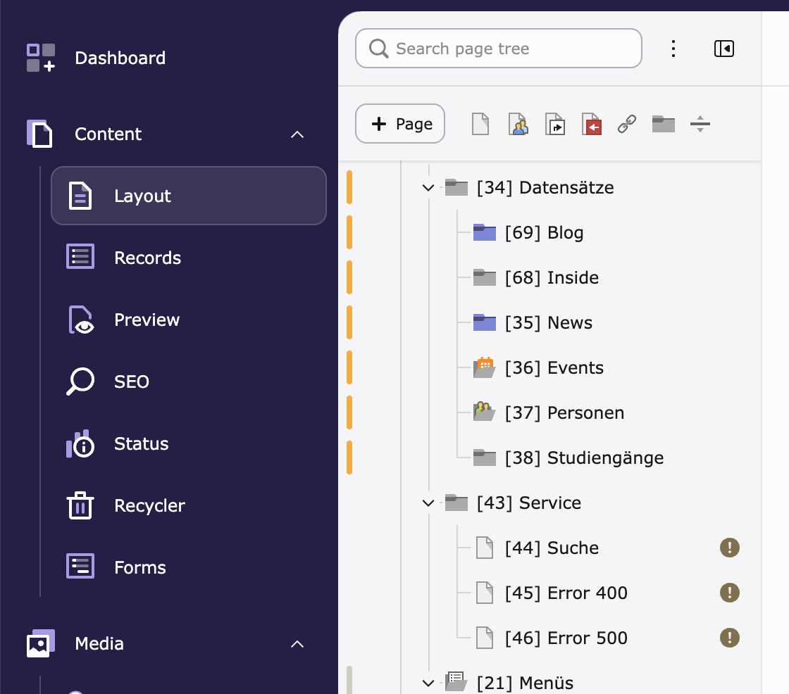

# TYPO3 Extension `empty_page_mark`

This extension marks pages without content elements in the TYPO3 page tree with a warning indicator.
Especially when starting a new project and creating a page structure can often lead to pages which have been created but still need content to be placed at.

## Installation

Use `composer require fonda/empty-page-mark` to install the extension.

## Credits

This extension was created by Georg Ringer for Fonda GmbH, Vienna.
